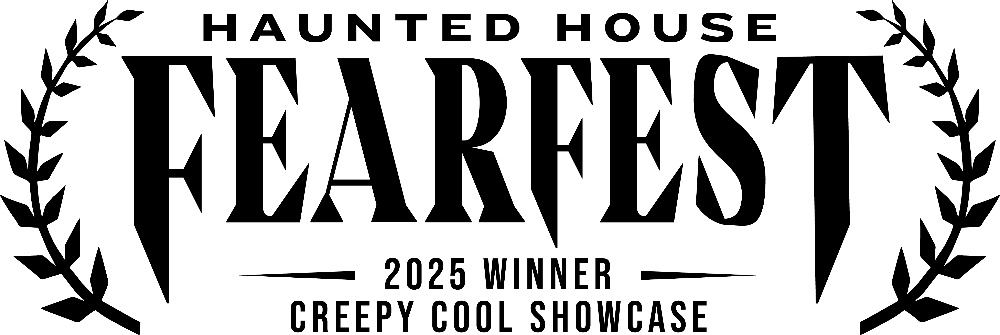

# Project Harvest 🌽

🏆 **Laurel Winner** - Haunted House Fearfest Creepy Cool Showcase



A survival horror game set in a shifting corn maze where the maze itself is alive, reshaping and remembering every previous attempt. Players enter expecting a fun Halloween attraction but quickly discover they're part of an experimental harvest program.

## 🎯 Core Concept

**Project Harvest** blends procedural horror with meta-narrative replayability. Each failed run becomes part of the maze's memory - your previous attempts manifest as corpses, notes, and whispers in subsequent playthroughs. The game pulls system date/time to create unique "harvest logs" that persist between sessions.

**Key Inspiration Sources:**
- **Creepy Maze System:** Procedural shifting maze with pickups and jumpscares
- **Forgotten in the Woods:** Branching narrative, sanity mechanics, and the Watcher entity

## 🎮 Key Features

### Core Horror Mechanics
- **🌪️ Living Maze:** 20×20 procedural grid that actively reshapes during gameplay
- **🔦 Limited Vision:** First-person perspective with dynamic fog and lighting
- **🧠 Sanity System:** Psychological degradation affects entity encounters and maze hostility
- **💀 The Choir:** Whispers of harvested subjects that drain sanity over time

### Meta-Horror Features
- **⚱️ Harvest System:** Each run logged with timestamp and death data
- **🔄 Echo System:** Failed attempts manifest as corpses, notes, and whispers in future runs  
- **📊 Experiment Logs:** Dr. Amundsen's research tracks every subject across time

## 🎲 Gameplay Loop

1. **Navigate** the maze with limited vision
2. **Collect** Weird Things and lore fragments  
3. **Manage** sanity while avoiding supernatural entities
4. **Survive** dynamic maze shifts that alter known paths
5. **Solve** landmark puzzles to unlock the exit
6. **Escape or Fail** → Your attempt becomes part of the next run's horror

## 🏗️ Technical Architecture

### Current Stack
- **Engine:** Godot 4.4
- **Language:** GDScript
- **Platform:** PC (Windows/Linux/Mac)

### Project Structure
```
project_harvest/
├── GDD.md                     # Game Design Document
├── project.godot              # Godot project file
├── scripts/                   # Core game systems
│   ├── autoloads/            # Global managers (GameDirector, TileManager, etc.)
│   ├── entities/             # Player, Stalker, Watcher implementations
│   ├── tiles/                # Tile system and door logic
│   └── ui/                   # HUD and interface systems
├── scenes/                    # Game scenes and prefabs
│   ├── tiles/                # Modular maze segment scenes
│   ├── entities/             # Entity prefabs
│   └── ui/                   # Interface scenes
├── assets/                    # 3D models, textures, audio
└── Concept Files/             # Legacy 2D prototype (reference only)
```

## 🚀 Getting Started

### Prerequisites
- **Godot Engine 4.4** for main development
- **Git** for version control

### Development Setup
1. Clone the repository
2. Open `project.godot` in Godot Engine 4.4
3. Review `GDD.md` for full design specifications
4. Run the project to test current graybox implementation

## 🧪 Design Philosophy

**"Each run is another harvested subject. The maze remembers. Your past selves litter the corridors."**

Project Harvest explores themes of:
- **Identity Fragmentation:** Encounters with doppelgängers and past selves
- **Experimental Horror:** Subjects unknowingly participating in consciousness experiments  
- **Temporal Recursion:** Failed attempts become environmental storytelling
- **Psychological Conditioning:** Weird Things as fragments of prior test runs

## 🤝 Contributing

This is currently a solo development project. Documentation and prototypes are available for reference and learning.

## 📄 License

- **Code** (Godot, shaders, tools): [MIT License](LICENSE)
- **Original Art** (models, textures, sounds): [CC BY 4.0](LICENSE-CC-BY-4.0)
- **Story and Writing**: All rights reserved
- **Third Party Assets**: Retain their original copyright

---

*"You aren't escaping alone—you're competing with every version of you that's already been consumed."*
